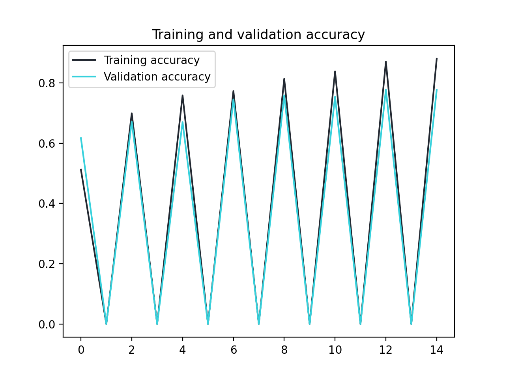
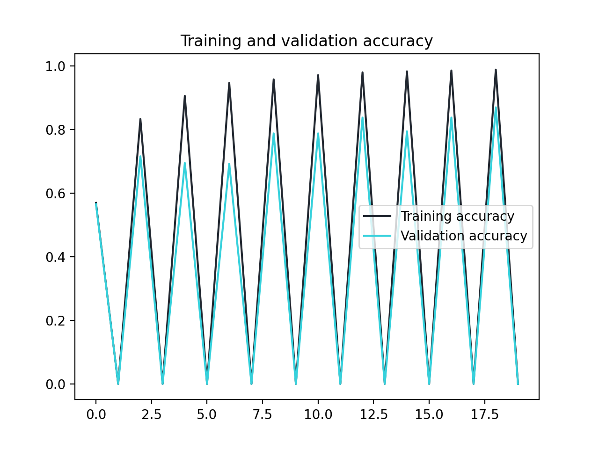
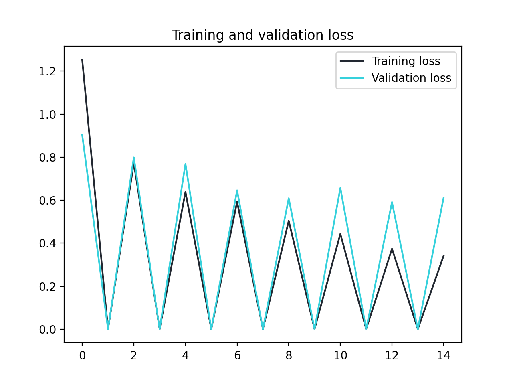
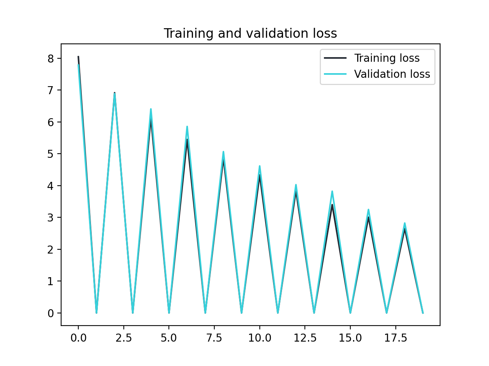
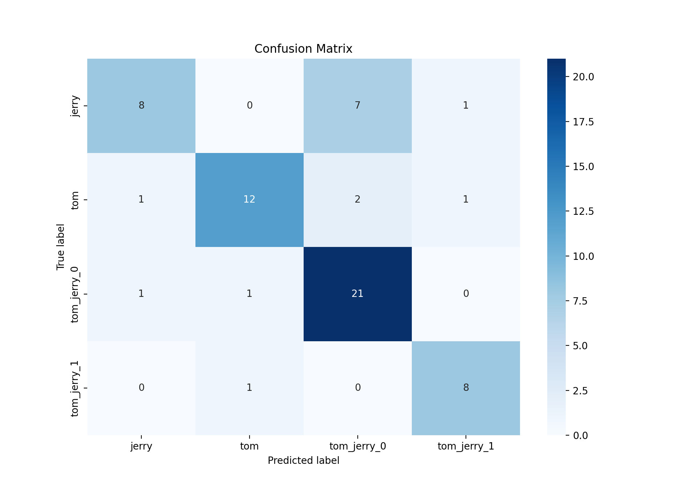
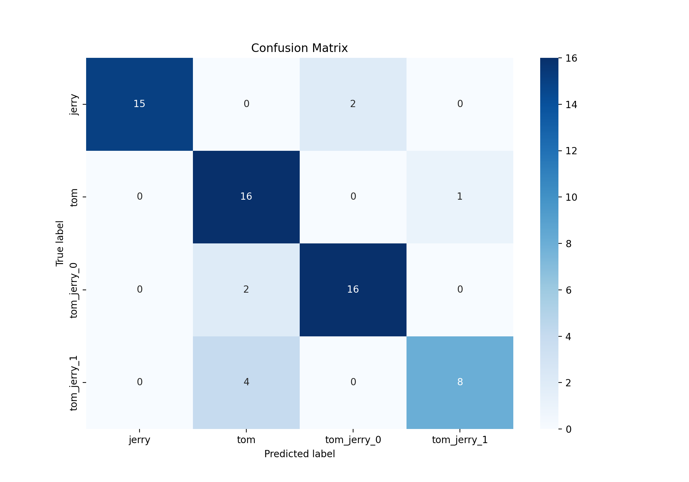

# TC3002B_M2AI_A01707371

Desarrollo de aplicaciones avanzadas de ciencias computacionales

Olivia Araceli Morales Quezada - A01707371

## Tom OR/AND Jerry

### Dataset

Este conjunto de datos contiene más de 5.000 imágenes (exactamente 5478 imágenes) extraídas de algunos de los vídeos de programas de Tom & Jerry, que están disponibles en línea.
Los videos descargados se convierten en imágenes con 1 cuadro por segundo (1 FPS).

Las imágenes etiquetadas se separan en 4 carpetas diferentes como se indica.

* Carpeta - tom_and_jerry
* SubCarpeta tom: contiene imágenes solo con 'tom'
* Subcarpeta jerry: contiene imágenes solo con 'jerry'
* Subcarpeta tom_jerry_1: contiene imágenes con 'tom' y 'jerry'
* Subcarpeta tom_jerry_0: contiene imágenes sin ambos caracteres

El dataset fue creado por BALA BASKAR y obtenido de Kaggle, [Tom and Jerry Image classification](https://www.kaggle.com/datasets/balabaskar/tom-and-jerry-image-classification).

### Estructura y Re-diseño del dataset

Se rediseñó la estructura del dataset con el proposito de obtener una distribución equitativa en clases y evitar desbalances que podrían llevar a un rendimiento preferencial para clases específicas. Ahora, el conjunto de datos utilizado para entrenar, validar y probar el modelo está organizado en tres subconjuntos principales y se divide en cuatro categorías de clases.

Los detalles de cada subconjunto y la distribución de clases son los siguientes:

* Train (Entrenamiento): Utilizado para entrenar el modelo, contiene un total de 3160 imágenes repartidas equitativamente en las cuatro clases. Este conjunto es esencial para que el modelo aprenda las características distintivas de cada clase.
* Validation (Validación): Compuesto por 903 imágenes, este conjunto se usa para validar el rendimiento del modelo durante el entrenamiento. Permite ajustar los parámetros del modelo sin utilizar el conjunto de prueba, lo que ayuda a evitar el sobreajuste.
* Test (Prueba): Contiene 452 imágenes y se utiliza para evaluar la capacidad del modelo de generalizar a nuevos datos, es decir, datos que no se han visto durante la fase de entrenamiento.

[Enlace al Dataset usado en este proyecto](https://drive.google.com/drive/folders/1LnohhlfKUx_iZhzmpwWX5ktAFWtwON_C?usp=drive_link)

### Preprocesamiento

El preprocesamiento de las imágenes es un paso crucial para preparar nuestros datos para el entrenamiento del modelo. Este proceso incluye:

* **Redimensionamiento de Imágenes:** Todas las imágenes se redimensionan a 224x224 píxeles.
* **Normalización:** Los valores de píxeles se escalan para estar en el rango [0, 1] para mejorar la convergencia durante el entrenamiento.
* **División de Datos:** El conjunto de datos se divide en 70% para entrenamiento, 20% para validación y 10% para prueba utilizando la biblioteca `splitfolders`.

### Carga de Datos con TensorFlow y Keras

Se usa `tf.keras.preprocessing.image.ImageDataGenerator` para cargar y transformar las imágenes en lotes, facilitando el manejo durante el entrenamiento. Esto no solo optimiza la memoria, sino que también introduce una ligera variación en los datos (data augmentation) para mejorar la generalización del modelo.

### Construcción del Modelo

En este proyecto, hemos construido un modelo de Red Neuronal Convolucional (CNN) utilizando la biblioteca `tf.keras`. El modelo consta de las siguientes capas:

* **Carga del Modelo Base:** Utilizamos la arquitectura MobileNetV2 como nuestro modelo base, preentrenado en el conjunto de datos _ImageNet_. Esto nos proporciona una sólida base de características visuales sin necesidad de entrenamiento adicional en nuestros datos específicos. La capa `include_top=False` significa que excluimos las capas densas finales del modelo base, lo que nos permite añadir nuestras propias capas personalizadas para adaptar el modelo a nuestro problema específico. Además, definimos el tensor de entrada utilizando `input_tensor` y congelamos los pesos del modelo base para evitar que se actualicen durante el entrenamiento estableciendo `base_model.trainable = False`.
* **Capa de Global Average Pooling:** Después de la salida del modelo base, agregamos una capa de _Global Average Pooling_ para reducir la dimensionalidad de las características extraídas y generar una representación compacta de la información visual.
* **Capas Densas Adicionales:** A continuación, añadimos capas densas adicionales para la clasificación. Comenzamos con una capa densa con 512 unidades y función de activación _ReLU_, que ayuda a aprender representaciones no lineales en los datos. Finalmente, agregamos una capa densa de salida con 4 unidades y función de activación _softmax_, que produce una distribución de probabilidad sobre las clases objetivo, permitiendo la clasificación de las entradas en una de las 4 categorías posibles.

#### Compilación del Modelo

El modelo se compila con los siguientes parámetros:

* **Optimizador:** Adam
* **Función de Pérdida:** Categorical Crossentropy
* **Métricas:** Accuracy

### Reafinamiento del Modelo

Se usa la misma base de la construccion del model, pero se incorporan:

* **Dropout:** Se ha agregado una capa de Dropout con una tasa del 30%. El Dropout es una técnica de regularización que ayuda a prevenir el sobreajuste al apagar aleatoriamente un cierto porcentaje de unidades durante el entrenamiento, lo que obliga al modelo a aprender representaciones más robustas y generalizables.
* **Programación del Ritmo de Aprendizaje:** Se utiliza una programación del ritmo de aprendizaje exponencial para ajustar dinámicamente la tasa de aprendizaje durante el entrenamiento.
* **Ajuste Fino (Fine-tuning):** Se aplica ajuste fino al modelo, descongelando algunas capas del modelo base para permitir que se adapten mejor a los datos específicos del proyecto.
* **Recompilar el Modelo:** Después de ajustar las capas del modelo base, se vuelve a compilar el modelo con un nuevo optimizador y una tasa de aprendizaje específica.

#### Parámetros Utilizados en el Reafinamiento

* initial_learning_rate: La tasa de aprendizaje inicial utilizada para entrenar el modelo. En este ejemplo, se ha establecido en 1e-4.
* lr_schedule: Un objeto ExponentialDecay que ajusta la tasa de aprendizaje durante el entrenamiento. La tasa de aprendizaje se reduce exponencialmente a medida que avanza el entrenamiento para mejorar la convergencia del modelo.
* fine_tune_at: El número de capas en el modelo base que se permiten entrenar durante el reafinamiento. En este ejemplo, se han congelado las primeras 50 capas del modelo base, y solo las capas posteriores se ajustan durante el reafinamiento.

### Entrenamiento del Modelo

Entrenamos el modelo, en 20 epocas, utilizando los datos de entrenamiento y validación. Durante el entrenamiento, monitorizamos la precisión y la pérdida en ambos conjuntos de datos para ajustar los parámetros y prevenir el sobreajuste.

### Evaluación del Modelo y Resultados

EL modelo inicial alcanzaba una taza de aciertos del 79%, después del reafinamiento, el modelo alcanzó una taza de aciertos en prueba del 89%. En las graficas se puede visualizar el comportamiento del modelo respecto a los valores de accuracy y loss durante el entrenamiento. 

### Initial Model vs Final Model 

#### Acuraccy

#### Loss

#### Confusion Matrix

## Recursos Bibliográficos

* S. Nazir and M. Kaleem, “Object classification and visualization with edge artificial intelligence for a customized camera trap platform,” Ecological informatics, vol. 79, pp. 102453–102453, Mar. 2024, doi: https://doi.org/10.1016/j.ecoinf.2023.102453.

* N. Sharma, V. Jain, and A. Mishra, “An Analysis Of Convolutional Neural Networks For Image Classification,” Procedia Computer Science, vol. 132, pp. 377–384, 2018, doi: https://doi.org/10.1016/j.procs.2018.05.198.
‌
* K. Dong, C. Zhou, Y. Ruan, and Y. Li, “MobileNetV2 Model for Image Classification,” 2020 2nd International Conference on Information Technology and Computer Application (ITCA), Dec. 2020, doi: https://doi.org/10.1109/itca52113.2020.00106.

* R. Indraswari, R. Rokhana, and W. Herulambang, “Melanoma image classification based on MobileNetV2 network,” Procedia Computer Science, vol. 197, pp. 198–207, 2022, doi: https://doi.org/10.1016/j.procs.2021.12.132.

* J. Praveen Gujjar, R. Prasanna Kumar H, and N. N. Chiplunkar, “Image Classification and Prediction using Transfer Learning in Colab Notebook,” Global Transitions Proceedings, Aug. 2021, doi: https://doi.org/10.1016/j.gltp.2021.08.068.
